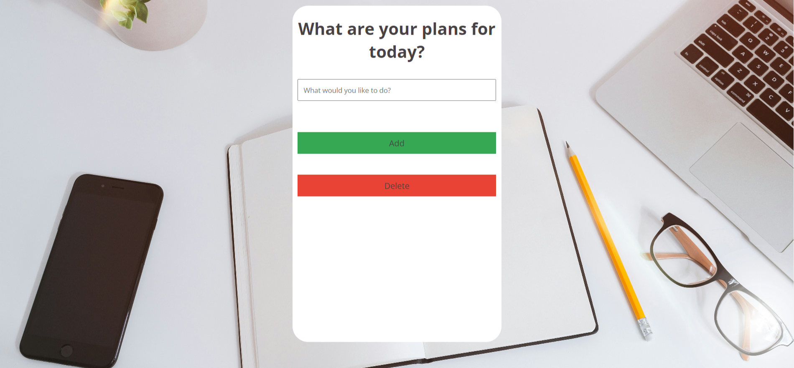
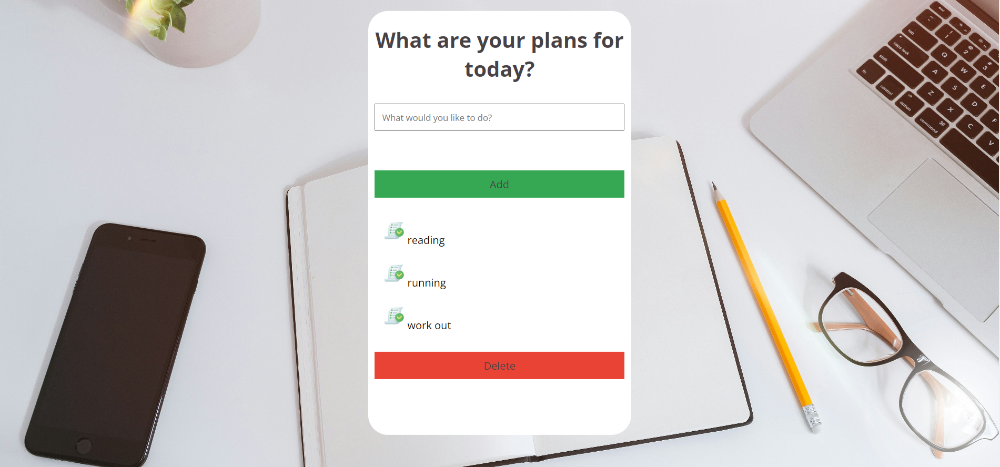
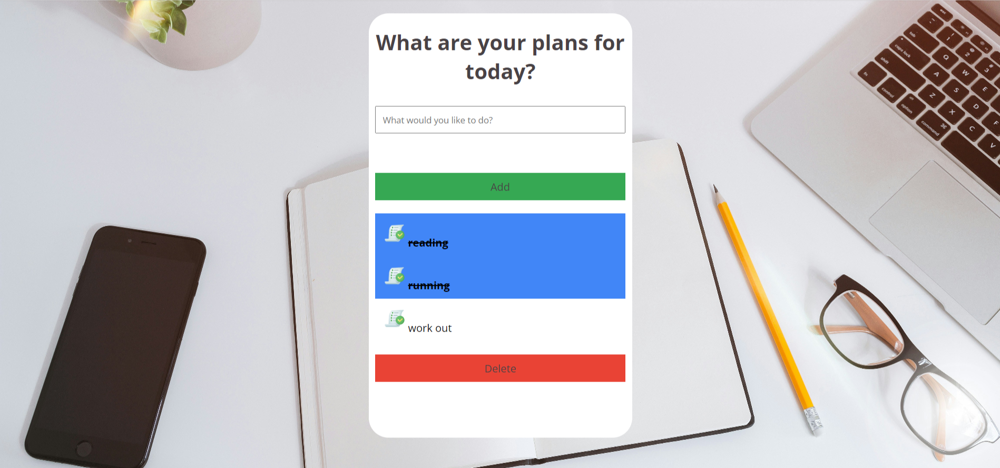

<h1 align="center">📝To do list React app</h1>

## https://appsitetodolist.netlify.app/
## About
## Screenshots

## Installation

In the project directory, you can run:

### `npm start`

Runs the app in the development mode.\
Open [http://localhost:3000](http://localhost:3000) to view it in your browser.

